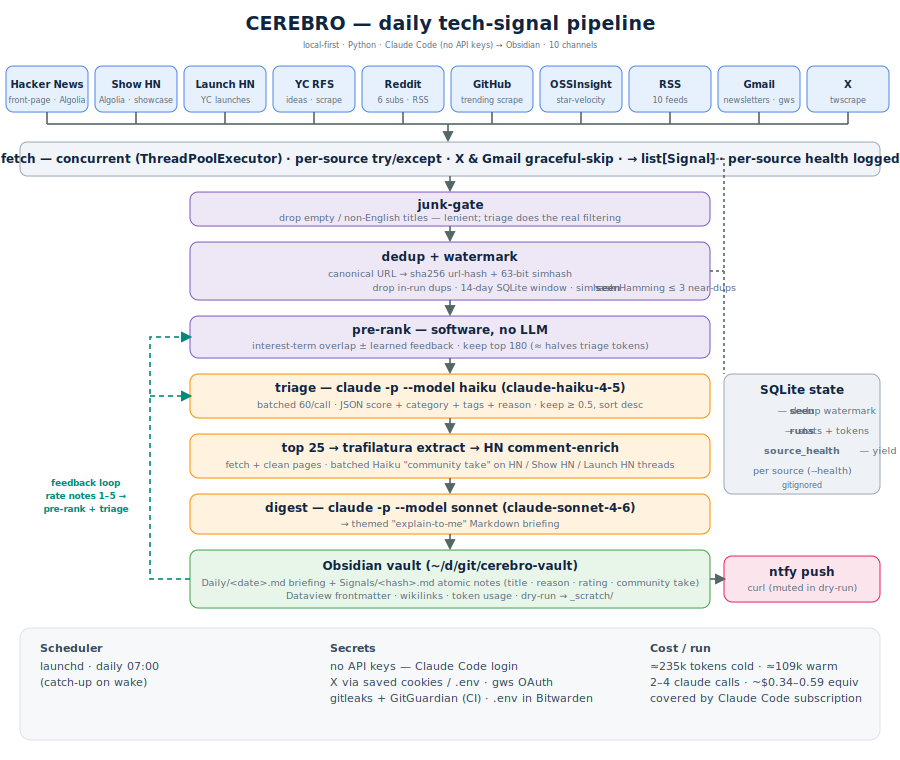

# CEREBRO 🧠📡

> Scans the noise for the signals matching your profile.
> A local-first, token-minimal daily tech-intelligence pipeline → Obsidian.

CEREBRO ingests raw tech signals from six sources (Hacker News, Reddit, GitHub Trending,
RSS, Gmail newsletters, X), filters them against a hyper-specific interest matrix, and
writes a clean **"explain-to-me" briefing** plus atomic, Dataview-queryable notes into an
Obsidian vault — every day at 07:00 via `launchd`. The cheap filtering pass runs on
Claude Haiku; the readable digest on Claude Sonnet. **No API keys** — it drives Claude Code
on the machine. Target: ~10 min/run, covered by your Claude Code subscription.



## Stack

| Layer | Choice |
|-------|--------|
| Language | Python 3.12 |
| LLM | **Claude Code** CLI (`claude -p`) — no API key, uses its own login |
| ↳ triage model | `--model haiku` → `claude-haiku-4-5-20251001` (cheap, batched JSON scoring) |
| ↳ digest model | `--model sonnet` → `claude-sonnet-4-6` (the user-facing briefing) |
| Hacker News | Algolia search API (`front_page` + `show_hn`) |
| Reddit | per-subreddit RSS via `feedparser` (the `.json` API 403s unauth) |
| GitHub | scrape of `github.com/trending` (daily + weekly windows) |
| RSS | `feedparser` over 10 curated feeds |
| Gmail | `gws` CLI (Google Workspace, own OAuth) |
| X / Twitter | `twscrape` — free, headless, **your saved Firefox cookies** (no API key) |
| Extract | `trafilatura` (HTML → clean text) |
| Dedup | `sha256` URL-hash + 63-bit simhash (stdlib) |
| State | SQLite (stdlib) — `seen` (dedup) + `runs` (stats + tokens) |
| Scheduler | `launchd` (07:00, catch-up on wake) |
| Notify | `ntfy` via `curl` |
| Output | Obsidian Markdown + Dataview frontmatter |
| Security | gitleaks + GitGuardian (pre-commit + CI), no secrets in repo |

## How it works

```
6 sources ─▶ fetch ─▶ junk-gate ─▶ dedup(+watermark) ─▶ Haiku triage
                                                            │ keep score ≥ 0.5
                                                            ▼
   Obsidian vault ◀─ Sonnet digest ◀─ trafilatura extract ◀─ top 25
   (daily + atomic notes)            (top 25 only)
```

| Stage | What it does | Code |
|-------|--------------|------|
| **fetch** | each source runs in its own try/except; X & Gmail skip gracefully if unavailable; everything normalizes to a `Signal` dataclass | `sources/*.py` |
| **junk-gate** | lenient — drops empty / mostly-non-English titles only. Real relevance is the triage pass (cheap enough to over-feed) | `process/junkgate.py` |
| **dedup + watermark** | see [Watermark](#watermark) below | `process/dedup.py` |
| **triage** | one `claude -p --model haiku` call per ~60 candidates; returns strict JSON `{score, category, tags}` scored against the interest matrix; keep `score ≥ 0.5`, sort | `llm/triage.py` |
| **extract** | `trafilatura` fetches + cleans the top-N pages (expensive, so post-triage only) | `process/extract.py` |
| **digest** | one `claude -p --model sonnet` call → themed "explain-to-me" Markdown briefing | `llm/digest.py` |
| **sink** | writes the daily note + one atomic note per signal; `ntfy` push. `dry_run` → `_scratch/`, ntfy muted | `sink/vault.py`, `sink/notify.py` |

## Sources

| Source | What we pull | Notes |
|--------|--------------|-------|
| **Hacker News** | `front_page` (top stories) + `show_hn` (Show HN), up to `limit` (60) each, via the Algolia API. Captures title, URL, points, comment count. | One request per list — no per-item fetches. We don't filter at fetch; triage scores relevance. |
| **Reddit** | newest posts from 6 subs (`ClaudeAI`, `ChatGPTCoding`, `LocalLLaMA`, `AI_Agents`, `vibecoding`, `cursor`) | Uses each sub's RSS feed (Reddit 403s the unauth `.json` API). Requests spaced 2s + Retry-After (RSS rate-limits). |
| **GitHub Trending** | repos making the biggest star moves — scrape of `github.com/trending` for **daily + weekly** windows, deduped. Captures `owner/repo`, description, and star count ("N stars today/this week"). | This is the "GitHunt" — discovery of star-gainers. Optional language filter (`languages: []` = all). |
| **RSS** | 10 curated industry feeds: Simon Willison, Latent Space, Interconnects, Claude Code + Codex release feeds, GitHub blog + changelog, OpenAI news, Product Hunt | `feedparser`, `limit` entries each. |
| **Gmail** | newsletter mail matching `(label:newsletters OR from:<senders>) newer_than:1d` (TLDR, Ben's Bites, ByteByteGo, …) | Via `gws`; each newsletter is treated as a link-aggregator. Intermittent (0 when no new mail in the window). |
| **X / Twitter** | tweets from your `search_terms` (filtered by `min_likes`) + all tweets from curator/follow accounts; **curator listicles auto-explode into one signal per embedded repo** | `twscrape` with your saved Firefox cookies — free, headless, no API key. Engagement (likes/RTs/replies/views) stored in note frontmatter. Skips gracefully if logged out. |

## Watermark

There is **no per-source timestamp cursor**. CEREBRO re-fetches each run (sources are
recency-bounded) and suppresses repeats with **content-hash dedup over a rolling 14-day
window** in the SQLite `seen` table — that table *is* the high-water mark.

```
per signal:
  canonical URL  = strip utm_/tracking params, lowercase host, drop fragment + trailing slash
  url_hash       = sha256(canonical)[:16]
  simhash        = 63-bit hash over (title + text)

drop if:
  ├─ url_hash already seen this run
  ├─ url_hash in `seen` within the last  dedup_days  (default 14)        ◀── the watermark
  └─ simhash Hamming-distance ≤ 3  vs any signal seen inside the window  (near-dup across sources)

after the run:
  mark EVERY surviving candidate into `seen` (first_seen, last_seen)
  → tomorrow's run won't re-triage them for 14 days
```

Tune `dedup_days` in `config/settings.yaml`; the Hamming threshold in `process/dedup.py`.
Trade-off: an item that scored < 0.5 today won't get a second look for 14 days.

## Configuration

Three files under `config/` (`settings.yaml` is gitignored — copy from `settings.example.yaml`):

| File | Holds |
|------|-------|
| `settings.yaml` | vault path, `dry_run`, `depth` (min/max/score_threshold), `dedup_days`, `models` (triage/digest aliases), `ntfy.topic`, schedule. **Gitignored** (ntfy topic is sensitive). |
| `sources.yaml` | per-source toggles + tuning (subreddits, RSS feeds, X search-terms/accounts, HN lists, GitHub windows) |
| `interest-matrix.yaml` | the triage rubric — 4 categories with descriptions + tags the LLM scores against |

### Adding / changing sources

**Tune an existing source — config only, no code:**

```yaml
# config/sources.yaml
rss:    { feeds: [ ...add a feed URL... ] }
reddit: { subreddits: [ ...add a sub... ] }
x:      { search_terms: [...], accounts: [ ...add a handle... ] }
```

**Add a brand-new source type — 3 steps:**

1. Write `cerebro/sources/<name>.py` exposing:
   ```python
   def fetch(cfg: dict, settings) -> list[Signal]: ...
   ```
   Return `Signal(url, title, source="<name>", clean_text=..., captured=now_iso(), meta={...})`.
   Catch your own errors and return `[]` to skip gracefully.
2. Register it in `cerebro/sources/__init__.py`:
   ```python
   from . import <name>
   SOURCES = { ..., "<name>": <name>.fetch }
   ```
3. Add a config block under `config/sources.yaml` with `enabled: true`.

The orchestrator picks it up automatically — same funnel, same dedup, same triage.

## Run it

```bash
# one-time
python3 -m venv .venv && .venv/bin/pip install -e .
cp config/settings.example.yaml config/settings.yaml   # set vault path + ntfy topic
pre-commit install                                     # local secret scanners

# dry-run (writes to <vault>/_scratch/, ntfy muted)
.venv/bin/python -m cerebro --dry-run

# go live (your call, after reviewing the _scratch/ briefing):
#   1. set dry_run: false in config/settings.yaml
#   2. load the daily 07:00 job
cp scripts/com.cerebro.daily.plist ~/Library/LaunchAgents/
launchctl load ~/Library/LaunchAgents/com.cerebro.daily.plist
```

Source prerequisites (all self-auth, no keys stored by CEREBRO): **Claude Code** logged in ·
**X** logged into x.com in Firefox (twscrape reads the cookie) · **Gmail** `gws auth login --readonly -s gmail`.

## Output

```
<vault>/
├── Daily/2026-06-20.md      # the briefing — themed, wikilinked, frontmatter incl. token usage
└── Signals/<url_hash>.md     # one atomic note per signal (Dataview-queryable)
```

Atomic-note frontmatter: `category`, `tags`, `source`, `url`, `score`, `captured`. Filenames
are the URL hash → idempotent re-runs.

## Cost

LLM runs via Claude Code (subscription, not metered API). A full run ≈ **575k tokens / ~10
`claude` calls / ~$1.15 API-equivalent** — ~60% of that is Claude Code's own ~35k cached
context × the call count, not your signal text. Bump the triage batch (60 → 120) to halve
the call count if you want it leaner. Sources are free APIs / cookies.

## Security

Public repo, **secrets-out by design**: no API keys (Claude Code, X cookies, and `gws` all
self-authenticate outside the repo). The only sensitive values — the `ntfy` topic and the X
`accounts.db` (cookies) — are gitignored. Two scanners (gitleaks + GitGuardian) run in
pre-commit and CI on every push. See [`SECURITY.md`](./SECURITY.md).

## Status

All 8 phases complete and validated end-to-end (dry-run produces a real 25-signal briefing).
Design: [`SPEC.md`](./SPEC.md) · build plan: [`plans/cerebro-implementation.md`](./plans/cerebro-implementation.md).
